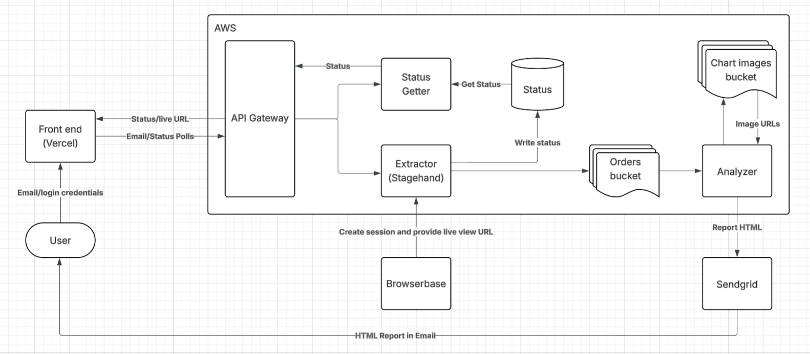

# 🍔 Uber Eats Order Tracker & Analyzer

An intelligent web automation system that extracts your Uber Eats order history and provides comprehensive analytics via email reports. Built with AWS serverless architecture, Stagehand web automation, and advanced data visualization.



## 🏗️ Monorepo Structure

This project follows a monorepo architecture with clearly separated concerns:

```
uber-eats-tracker/
├── 🏗️ infra/                    # AWS CDK Infrastructure as Code
│   ├── app.py                   # CDK app entry point
│   ├── stack.py                 # Main infrastructure stack
│   └── requirements.txt         # Python CDK dependencies
├── ⚡ serverless/               # Lambda functions
│   ├── extractor/               # TypeScript web automation
│   │   ├── index.ts            # Main extraction logic
│   │   ├── utils.ts            # Caching and utility functions
│   │   └── stagehand.config.ts # Browser automation config
│   ├── analzyer/                # Python data analysis
│   │   ├── analyzer.py         # Order analysis and email generation
│   │   └── requirements.txt    # Python dependencies
│   └── status-getter/           # TypeScript status API
│       └── index.ts            # Status checking endpoint
├── 🔄 .github/workflows/        # CI/CD automation
├── 📊 images/                   # Documentation assets
└── 📁 downloads/                # Local testing artifacts
```

## 🚀 Architecture Overview

### Core Components

1. **🌐 API Gateway** - Async REST API with authentication
2. **🤖 Extractor Lambda** - Web automation using Stagehand/Browserbase
3. **📊 Analyzer Lambda** - Data processing and email generation
4. **📄 Status Lambda** - Real-time status tracking
5. **🗄️ DynamoDB** - Extraction status and metadata
6. **☁️ S3** - Order data and chart storage
7. **📧 SendGrid** - Email delivery service

### Workflow

1. **API Request** → User calls `/extract` endpoint
2. **Browser Session** → Stagehand automates Uber Eats login & extraction
3. **Data Storage** → Orders saved to S3, triggers analyzer
4. **Analysis** → Python generates insights, charts, and HTML report
5. **Email Delivery** → SendGrid sends comprehensive analysis report

## 🛠️ Technology Stack

### Infrastructure
- **AWS CDK** (Python) - Infrastructure as Code
- **AWS Lambda** - Serverless compute
- **API Gateway** - REST API with rate limiting
- **DynamoDB** - NoSQL database for status tracking
- **S3** - Object storage for data and assets

### Backend Services
- **TypeScript** - Extractor and status services
- **Python** - Data analysis and visualization
- **Stagehand** - AI-powered web automation
- **Browserbase** - Cloud browser infrastructure

### Data & Analytics
- **Pandas** - Data manipulation and analysis
- **Matplotlib/Seaborn** - Chart generation
- **SendGrid** - Email delivery with HTML templates

## 🔧 Setup & Deployment

### Prerequisites
```bash
# Install dependencies
npm install
pip install -r infra/requirements.txt

# Configure AWS credentials
aws configure

# Install CDK globally
npm install -g aws-cdk
```

### Deploy Infrastructure
```bash
cd infra
cdk bootstrap  # First time only
cdk deploy
```

### API Endpoints

**Start Extraction**
```bash
POST /v1/extract
Headers: x-api-key: <your-api-key>
Body: { "userEmail": "user@example.com" }
Response: 202 Accepted
```

**Check Status**
```bash
GET /v1/extract/{userEmail}
Headers: x-api-key: <your-api-key>
Response: { "status": "completed", "message": "...", "liveViewUrl": "..." }
```

## 📊 Features

### Intelligent Extraction
- **🔐 Automatic Login Detection** - Handles both logged-in and logged-out states
- **🖥️ Live Browser View** - Real-time session monitoring during login
- **📜 Complete History** - Loads all available order data
- **🛡️ Error Handling** - Robust retry mechanisms and status tracking

### Advanced Analytics
- **📈 Spending Trends** - Monthly and cumulative spending visualization
- **🕐 Usage Patterns** - Peak ordering times and preferred days
- **🍽️ Restaurant Insights** - Top restaurants and ordering frequency
- **💰 Smart Comparisons** - "Could have bought X instead" calculations
- **📧 Beautiful Reports** - Professional HTML email templates

### Operational Excellence
- **⚡ Async Processing** - Non-blocking API with status polling
- **🔒 Secure Architecture** - API key authentication and IAM policies
- **📊 Comprehensive Logging** - CloudWatch integration for monitoring
- **🌐 CORS Support** - Frontend-ready API configuration

## 🔄 Status States

- `starting` - Initializing browser session
- `awaiting_login` - User needs to login via live view
- `extracting` - Collecting order data
- `completed` - Analysis email sent successfully
- `error` - Process failed with error details

## 🎯 Use Cases

- **📱 Personal Analytics** - Understand your food ordering habits
- **💡 Budget Insights** - Track spending patterns and trends
- **🍕 Restaurant Preferences** - Discover your favorite ordering patterns
- **📊 Data Export** - Get structured data for further analysis

## 🚦 Development

### Local Testing
```bash
# Test individual components
cd serverless/extractor && npm test
cd serverless/analzyer && python -m pytest

# Local CDK testing
cd infra && cdk synth
```

### CI/CD
GitHub Actions automatically:
- ✅ Runs tests on all components
- 🔨 Builds TypeScript and Python packages
- 🚀 Deploys infrastructure changes
- 📊 Updates Lambda functions

---

**Built with ❤️ using [Stagehand](https://github.com/browserbase/stagehand) web automation**
